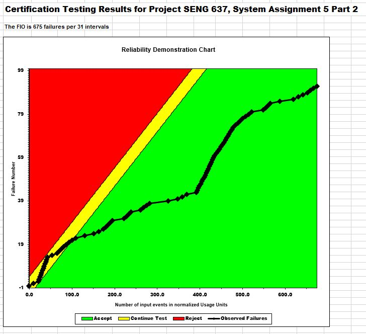
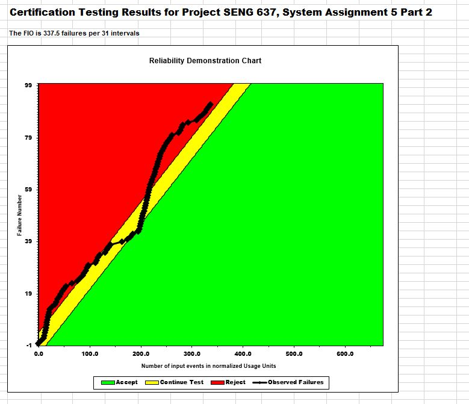

**SENG 637- Dependability and Reliability of Software Systems\***

**Lab. Report \#5 – Software Reliability Assessment**

| Group \#:      | 10            |
| -------------- | ------------- |
| Student Names: | Dhananjay Roy |
|                | Munal Akhtar  |
|                | Amney Brahme  |
|                | Tejpreet Bal  |
|                | Harshil Patel |

# Introduction

In this assignment, we will investigate the application of Reliability Growth Testing (RGT) and Reliability Demonstration Chart (RDC) in evaluating the reliability of a software system.

We will then analyze and contrast these techniques to understand their similarities and differences.

#

# Assessment Using Reliability Growth Testing

In the course of our Reliability Growth Testing, following the recommendations of the assignment, we settled on using C-SFRAT as our analytical tool. We favored C-SFRAT for its intuitive interface that facilitates easy comparison of models under varying covariate scenarios.

Our method involved initially applying C-SFRAT to our full failure dataset, utilizing every conceivable combination of models and covariates. This helped us identify the model that most accurately reflected the patterns in our failure data, as presented in the [model_comparison.csv](modified_artifacts/C_SFRAT_Model_Comparison.csv) file.

For the purpose of model selection, we leaned on the Akaike's Information Criteria (AIC) and Bayesian Information Criteria (BIC), both of which are calculated by C-SFRAT. These criteria are pivotal in the field of model selection; the most effective model is typically the one that can account for the maximum variance with the least number of predictors, as indicated by the lowest AIC value. Similarly, a lower BIC value suggests a model's better predictive performance for future datasets.

Upon scrutinizing the Model Comparison tables produced by C-SFRAT, it was discerned that the Discrete Weibull Type 3 model, supplemented with covariate F, stood out as the superior model, boasting an AIC of 122.199 and a BIC of 127.935. Following closely was the Geometric Model with covariate F, exhibiting an AIC of 125.323 and a BIC of 129.625.

Further examination with varied data ranges within these models revealed that a data subset comprising 21 of the full 31 intervals (encompassing roughly 67-70% of the complete failure dataset) yielded the most accurate results when the Covariate F was set at 20 efforts per interval.

This optimal data subset selection may be attributed to a marked rise in failure rates post the 20th interval. Therefore, limiting the dataset to the intervals preceding this surge proved more effective for model predictions, signifying that incorporating the data beyond this point might not enhance the forecasting accuracy with the chosen models.

Time to Failure Plot of the two models:

Intensity Plot

As seen from the plot, the failure rate and mean time to failure (MTTF) for the original failure data and the predictions at the last interval (31) are:

| Dataset        | Failure Rate (F/Interval) | MTTF (intervals) |
| -------------- | ------------------------- | ---------------- |
| Raw Data       | 92/31 = 2.96              | 1/2.96 = 0.337   |
| DW3 Prediction | 91/31 = 2.94              | 1/2.94 = 0.341   |
| GM Prediction  | 90/31 = 2.90              | 1/2.90 = 0.344   |

Using interval 21 for DW3 and GM models to predict the last 10 intervals, the failure rate and MTTF are very close to the original failure data.

#### Decision making based on given Target Failure Rate

Predictive models serve a critical function for businesses prioritizing software reliability. They employ these models to forecast whether their software will meet, exceed, or fall short of predefined reliability benchmarks, such as target failure rates or mean times to failure (MTTF).

Take, for instance, a business that has set an acceptable threshold at 3 Failures/Interval. At the 31st interval, the system under test (SUT) is performing within acceptable limits, as indicated by the raw data's failure rate of 2.96 per interval. The Discrete Weibull Type 3 model, however, provides a means to anticipate the point in the future when the failure rate might breach this acceptable threshold.

#### Advantages and Disadvantages of Reliability Growth Testing

**Advantages**

- Reliability Growth Testing (RGT) equips users with the ability to forecast failure trends by applying a variety of established models, while also facilitating model selection and comparison through the use of metrics such as AIC and BIC.

**Disadvantages**

- The accuracy of the forecasts is contingent upon the data range selected. Distortions or anomalies within the data subset can lead to inaccurate predictions.

- The reliability of the predictions is also inherently tied to the suitability of the chosen model. An ill-fitting model could result in unreliable forecasts.

# Assessment Using Reliability Demonstration Chart

For the second segment of our laboratory investigation, the RDC-11 worksheet and Macros were instrumental in processing and analyzing the provided failure data. Prior to plotting, essential calculations were executed, including the determination of cumulative failures and the time intervals between each failure. We assumed a uniform distribution of failures for this analysis, a standard practice in such assessments. The intricacies of these calculations are documented in the "Pre-Processing Raw Data" file.

In establishing the risk profile, key parameters were defined as follows:
| Parameter | Value |
|------------|-----------|
|Discrimination Ratio | 2 |
|Developer's Risk | 0.05 |
| User's Risk | 0.05 |

The Mean Time to Failure (MTTF) values were derived using the formula: T/FC or 1/FIO.

The initial plot was generated using an MTTF of 0.3, which was determined based on a Failure Intervals Observation (FIO) of 90 failures within 31 intervals. Notably, this setting resulted in the majority of the graph falling within the reject zone, indicating suboptimal performance.

Subsequently, the plot was recalibrated with an MTTFmin of 0.046, calculated from a dataset of 675 failures observed across 31 intervals.

)

Finally, the graph was refined further with an MTTF of 2\*MTTFmin, equating to 0.092. This adjustment was derived from an analysis of 337.5 failures observed over the same 31 intervals. Despite these modifications, the majority of instances remained either within the realm of continuous testing or the reject zone, suggesting ongoing challenges in achieving desired reliability levels.

)

#### Advantages and disadvantages of Reliability Demonstration Chart

**Advantages**

- The Reliability Demonstration Chart (RDC) offers an intuitive visual representation that helps users quickly determine the acceptability of the System Under Test (SUT), aligned with the risk tolerances of both the user and developer.

- RDC is a cost-effective and time-saving method because it relies on straightforward data manipulation and visualization techniques.

- It also presents a clear visual guide that aids in decision-making about the optimal point to conclude testing and make a call on whether to accept or reject the SUT based on the results.

**Disadvantages**

- RDC falls short when it comes to computing the exact numerical estimates of the system's reliability or availability.

- Estimating the minimum mean time to failure (MTTFmin) can be challenging, and inaccuracies in this estimate can render the RDC invalid and its insights irrelevant.

#

# Comparison of Results

In evaluating the outcomes derived from Reliability Growth Testing and the Reliability Demonstration Chart, it is critical to align them against a common standard. Here, we utilize the minimum mean time to failure (MTTFmin) set at 0.046 as outlined in the RDC section to benchmark our comparison.

With an MTTFmin of 0.046 established by RDC, and an MTTF of 0.337 identified in the Reliability Growth Testing for the SUT, the system would be deemed satisfactory. RDC, however, offers a more straightforward visual cue for discerning when the failure instances cross the threshold from acceptable to rejectable, which enhances its efficacy in determining whether the SUT meets the standard.

In summary, each method is tailored for distinct aspects of reliability assessment: Reliability Growth Testing is adept at forecasting failure trends, while Reliability Demonstration Chart excels at informing the decision to halt testing based on a spectrum of risk considerations.

# Discussion on Similarity and Differences of the Two Techniques

While both Reliability Growth Testing (RGT) and Reliability Demonstration Chart (RDC) aim to provide insights into system reliability, they exhibit certain similarities and differences.

#### Similarities

- Both methods are employed to ascertain the reliability metrics of a system.

- Each technique hinges on established benchmarks like target failure rates or MTTF.

- Both require access to empirical failure data to function effectively.

#### Differences

- RGT leverages historical failure data to forecast future reliability, while RDC assesses whether current failure rates meet predefined reliability targets.

- RGT relies on modeling the failure data with statistical curves for predictive analysis, whereas RDC uses a risk-based approach to validate system reliability.

- RGT focuses on projecting future reliability trends using selected models, in contrast, RDC is geared towards immediate decision-making, determining the acceptability of the SUT against a risk profile.

# How the team work/effort was divided and managed

#

# Difficulties encountered, challenges overcome, and lessons learned

1. Selecting the appropriate reliability testing tool presented some challenges for our project.

   - Our team initially considered the **SRTAT-SRE-tool**. It managed to process sample data files but failed to accept our target data file. Additionally, we faced a lack of guidance, as there was no accessible documentation on usage or input formats, and the tool’s [help page](http://www.dtic.mil/dtic/tr/fulltext/u2/a275405.pdf) provided no assistance.

   - Our next attempt was with **CASRE**, which proved incompatible with a 64-bit Windows 11 system. Attempts to run the program resulted in persistent errors, as depicted in the screenshot of the CASRE error.

   - Our search concluded with **C-SFRAT**, which functioned without issue.

2. The Reliability Demonstration Chart (RDC) provided did not align with the failure data of the System Under Test (SUT). We needed to substantially adjust the RDC to incorporate the correct quantity of data points from the failure data. The revised RDC can be found [here](modified_artifacts/RDC.xlsm).

3. The original RDC chart did not accurately reflect the accept/continue/reject zones, and altering the risk profile failed to affect the chart. Consequently, we had to overhaul the Excel sheet.

4. The failure data format was incompatible with the RDC, as it was presented as failures per interval instead of the required format, which is time between failures.

5. We converted the failures per interval data into time between failures by presuming an even distribution of failures within each interval. This assumption is likely flawed, casting doubt on the accuracy of our results.

6. The RDC lacked a specific target for mean time to failure/failure intensity objective (MTTF/FIO) or a designated risk profile. We defaulted to the pre-set risk profile, but it's worth noting that an alternative profile could markedly alter the outcomes. This uncertainty leaves us unable to conclusively determine the acceptability of the SUT.

# Comments/feedback on the lab itself

1. The provided assignment description document, titled [`Assignment_Description.md`](Assignment_Description.md), lacks comprehensive detail.

2. Utilization of the suggested software, **SRTAT-SRE-tool**, has proven to be quite challenging due to the absence of any accompanying documentation or user guidance.

3. The Reliability Demonstration Chart’s design could be more user-friendly, especially in accommodating the complete set of failure data for accurate graphing.

4. The documentation accompanying the failure dataset is insufficient, which hampers a clear understanding and proper analysis.
